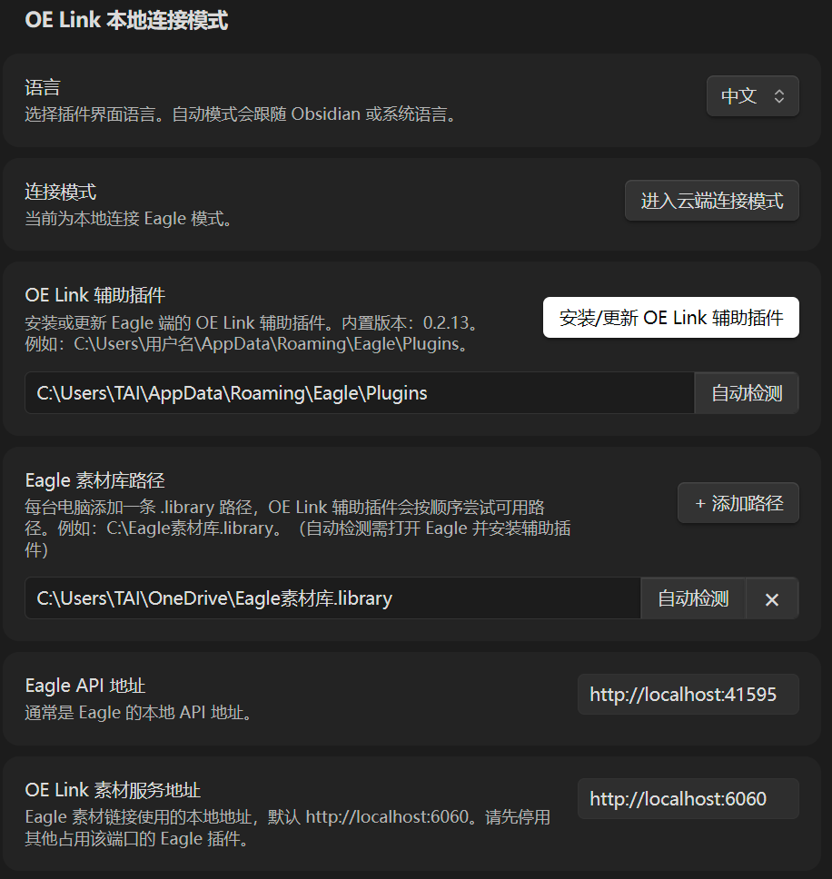
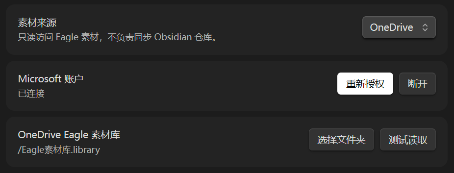
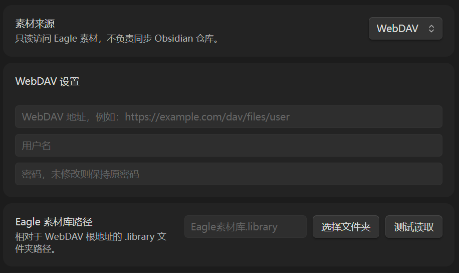
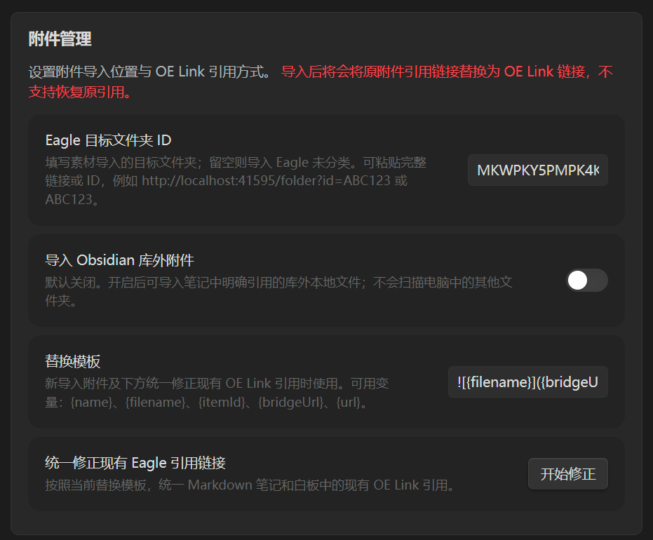
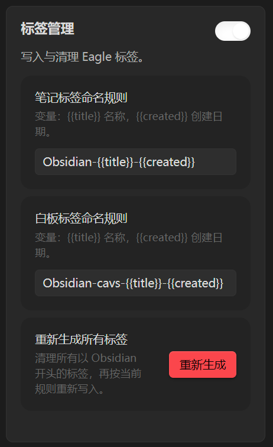
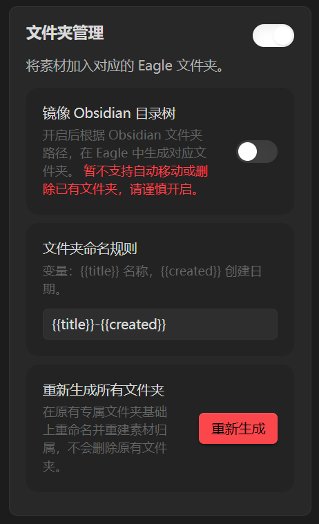
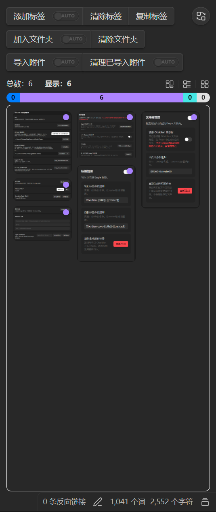
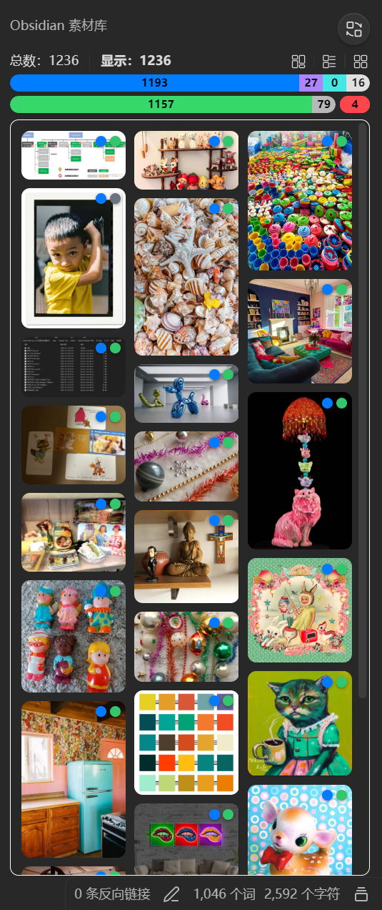

# OE Link

[简体中文](./README.md) | **English**

> Keep text in Obsidian and leave attachments to Eagle.

## 1. Overview

OE Link provides a stable workflow for referencing, importing, and managing assets between Obsidian and Eagle.

`Original large Obsidian vault` -> `OE Link import and conversion` -> `Lightweight text-focused Obsidian vault` + `Independent Eagle library`

With OE Link, you can **gradually move attachments out of your Obsidian vault and import them into Eagle** while keeping previewable, locatable, and manageable references in your notes. This **reduces the burden that large numbers of attachments place on the Obsidian vault and synchronization**, while preserving Eagle's thumbnails, tags, folders, and asset management features.

In addition to local desktop connections, OE Link provides a **cloud access mode**. Phones, tablets, and computers without Eagle running can use OneDrive or WebDAV to view Eagle assets referenced by notes.

> [!IMPORTANT]
> OE Link is an independently maintained third-party community plugin. It is not affiliated with, authorized by, or endorsed by Obsidian or Eagle. Eagle, Obsidian, OneDrive, WebDAV, and related names and trademarks belong to their respective owners.

## 2. Installation and Setup

### 2.1 Requirements and Platform Support

- Local connection mode requires desktop Obsidian, Eagle, and OE Link Helper.
- Cloud connection mode supports OneDrive or a user-configured WebDAV service. Mobile devices always use cloud connection mode.
- Eagle is independent third-party software. Users must install it separately and comply with its license terms.
- OE Link does not synchronize the Obsidian vault. You can continue using Obsidian Sync, Remotely Save, or another synchronization tool.
- OE Link is primarily developed and tested on Windows and Android. Desktop supports both local and cloud connections. macOS, Linux, and iOS have not been fully tested.

### 2.2 Install OE Link

Before OE Link is officially available in the Obsidian community plugin directory, install it using either of these methods:

1. Download `main.js`, `manifest.json`, and `styles.css` from the project's GitHub Release.
2. Create an `oe-link` folder under `.obsidian/plugins/` in your Obsidian vault and place the three files inside it.
3. Restart Obsidian and enable OE Link under Settings -> Community plugins.

You can also add this GitHub repository through BRAT for test installation.

### 2.3 Install OE Link Helper

Local connection mode requires OE Link Helper on the Eagle side:

1. Open Settings -> OE Link.
2. Check or automatically detect the Eagle plugin directory.
3. Select "Install/Update OE Link Helper".
4. If it does not take effect immediately, restart Eagle or reload the helper from Eagle's plugin panel.

If an older EagleBridge plugin or another Eagle plugin using the same port is installed, disable the conflicting service first.

### 2.4 First Connection

For local mode, open Eagle first, check the connection status in OE Link settings, and confirm that the Eagle library path is correct. For cloud mode, select OneDrive or WebDAV, authorize the account or enter the connection details, and then select the Eagle `.library` path that has already been synchronized to the cloud.

### 2.5 Network, Permissions, and Privacy

Depending on your choices, OE Link can access:

- Notes and attachments inside the Obsidian vault.
- The local Eagle API, OE Link Helper, and Eagle `.library` files.
- Microsoft OneDrive authorized by the user or a user-configured WebDAV service.
- Original URLs for network assets that the user explicitly opens.

Cloud accounts and services remain under the control of their respective providers. Review diagnostic logs before sharing them. Logs should not contain passwords or access tokens.

### 2.6 Known Limitations and Safety Notice

- **<mark style="background:#ff4d4f">Original attachment references are replaced after import and cannot be restored automatically.</mark>**
- <mark style="background:#ff4d4f">Enabling "Automatically clean up after import" moves original attachments to the Obsidian trash after a successful import. Back up your vault and test manually before enabling automation.</mark>
- Cloud mode is read-only and does not remotely modify Eagle tags, folders, or assets.
- Check the active filters and keep a backup before deleting, cleaning, or moving assets in bulk.
- Assets may temporarily become unavailable when ports, cloud permissions, library paths, or original files change.
- If a share package contains missing assets, OE Link lists the affected files. Check the exported result before sharing it.

## 3. Connection Modes

```text
Local connection mode:
Obsidian <-> OE Link <-> OE Link Helper <-> Eagle library

Cloud connection mode:
Obsidian <-> OE Link <-> OneDrive / WebDAV <-> Eagle library
Obsidian Vault <-> Remotely Save or another sync tool <-> Other devices
```

**OE Link connects attachments with Eagle assets. The Obsidian vault itself is synchronized by Obsidian Sync, Remotely Save, or another synchronization tool.**

### 3.1 Local Connection Mode

Local connection mode is intended for computers with Eagle installed. In this mode, OE Link uses the local Eagle API and OE Link Helper to:

- Query, import, and locate Eagle assets.
- Add or clean Eagle tags.
- Create and maintain Eagle folder relationships.
- Serve images and attachments for OE Link addresses in notes.
- Open assets or their folders in Eagle directly from Obsidian.



OE Link Helper is installed in Eagle. It provides the local asset service and helps OE Link locate the correct Eagle library.

The default local asset address is:

```text
http://localhost:6060
```

The Eagle local API usually uses:

```text
http://localhost:41595
```

### 3.2 Cloud Connection Mode

Cloud connection mode is intended for phones, tablets, and computers where Eagle is not running. It currently supports Microsoft OneDrive and user-configured WebDAV services.

Cloud mode reads an Eagle `.library` that has already been synchronized to the cloud. Eagle does not need to run on the device. It supports:

- Displaying OE Link images in Reading view and Live Preview.
- Selecting Eagle thumbnails or original files according to file size.
- Loading only images near the current viewport while limiting concurrent downloads.
- Manually loading or downloading Eagle originals and attachments.
- Opening documents and other attachments with the system default application.
- Previewing compatible audio and video with Obsidian's native players.
- Displaying non-previewable attachments as file cards.

Mobile devices always use cloud connection mode. Cloud mode provides read-only asset access. It does not remotely modify Eagle tags, folders, or assets, and it does not synchronize the Obsidian vault.

| OneDrive | WebDAV |
| -------- | ------ |
|  |  |

## 4. Features

### 4.1 Management Features

The following write and management features are available only in local connection mode.

| Attachment management | Tag management | Folder management |
| --------------------- | -------------- | ----------------- |
| Import local images and other attachments into Eagle while preserving references in notes. | Synchronize Obsidian note identities and tags to Eagle so assets can be traced back to notes. | Organize matching assets in Eagle according to the Obsidian note or folder structure. |
|  |  |  |

### 4.2 Interface

| Category | Current Note view | Obsidian Library view |
| -------- | ----------------- | --------------------- |
|          |  |  |
| Buttons | **Add tags**: Add the current note's tag to referenced assets.<br>**Clear tags**: Remove Obsidian-managed tags from the current note or all attachments.<br>**Copy tag**: Copy the tag corresponding to the current note.<br>**Add to folder**: Add referenced assets to the Eagle folder corresponding to the current note.<br>**Clear folders**: Remove Obsidian folder assignments from the current note or all attachments.<br>**Import attachments**: Import attachments from the current note into Eagle.<br>**Clean imported attachments**: Clean local copies already imported into Eagle.<br>**AUTO toggles**: Control automatic tagging, folder assignment, attachment import, and cleanup after import.<br>**View switch**: Open the Obsidian Library view.<br>**Layout buttons**: Switch between grid, list, and masonry layouts. | **View switch**: Return to the Current Note view.<br>**Layout buttons**: Switch between grid, list, and masonry layouts.<br>**Source statistics bar**: Filter assets from the Eagle library, inside the Obsidian vault, outside the Obsidian vault, or the internet.<br>**Reference statistics bar**: Filter referenced, unreferenced, and trashed assets. |
| Display and filters | Show all attachments referenced by the current note or canvas.<br>Show total, displayed, and selected asset counts.<br>Filter by Eagle library, inside the Obsidian vault, outside the Obsidian vault, or internet source.<br>Hold `Ctrl` and scroll the mouse wheel to resize cards or list rows.<br>Open note cards embedded in a canvas to inspect that note's referenced attachments. | Summarize all assets associated with Obsidian.<br>Show total, displayed, and selected asset counts.<br>Combine the two statistics bars to filter by source and reference state.<br>Load more assets in batches while scrolling down.<br>Hold `Ctrl` and scroll the mouse wheel to resize cards or list rows. |
| Asset actions | **Click an asset**: Select it and locate its reference in the note, or vice versa.<br>**Ctrl + click**: Add or remove individual assets from the selection.<br>**Shift + click**: Select a continuous range.<br>**Double-click an image**: Open the large image preview.<br>**Click empty space**: Clear the selection.<br>**Right-click an asset**: Open the asset action menu. | < |
| Hover information | Hover over an asset to see its file name, source, reference state, and Eagle asset ID.<br>In grid and masonry layouts, hovering displays an asset information overlay.<br>Hover over a colored dot to see the asset source, referenced, unreferenced, or trash state. | < |

### 4.3 Context Menus

**Sidebar asset context menu**

- Copy attachment
- Copy attachment reference
- Import selected assets to Eagle
- Attempt repair
- Move to Obsidian trash
- Move to Eagle trash
- Open with default application
- Open file location
- Open original URL in browser
- Copy original URL
- Open in Eagle
- Open Eagle folder
- Locate reference

**In-note attachment context menu**

- Import this attachment to Eagle
- Copy attachment
- Copy attachment reference
- Open in Eagle
- Locate reference

**Note file menu**

- Export note share package
- Export ZIP
- Export folder

## 5. Project Information

### 5.1 Acknowledgements and Inspiration

Parts of OE Link's workflows and interface design were inspired by the following community projects and introduction videos:

- [Obsidian-EagleBridge](https://github.com/zyjGraphein/Obsidian-EagleBridge)
- [Obsidian EagleBridge plugin introduction](https://www.bilibili.com/video/BV1voQsYaE5W/)
- [Imagine](https://github.com/AlbusGuo/albus-imagine)
- [Imagine plugin introduction](https://www.bilibili.com/video/BV1QfrWBsE9s/)

Thanks to these projects for contributing ideas to Obsidian attachment management. OE Link is maintained independently and is not affiliated with them.

### 5.2 Issue Reports

When reporting an issue, include the versions of Obsidian, OE Link, Eagle, and OE Link Helper; the connection mode; the steps performed; and the actual result. If needed, attach a reviewed standard or deep diagnostic log. Do not publish passwords, access tokens, or other sensitive information.

### 5.3 License

OE Link is licensed under the MIT License. Refer to the GitHub repository for official releases, downloads, and changelogs.
